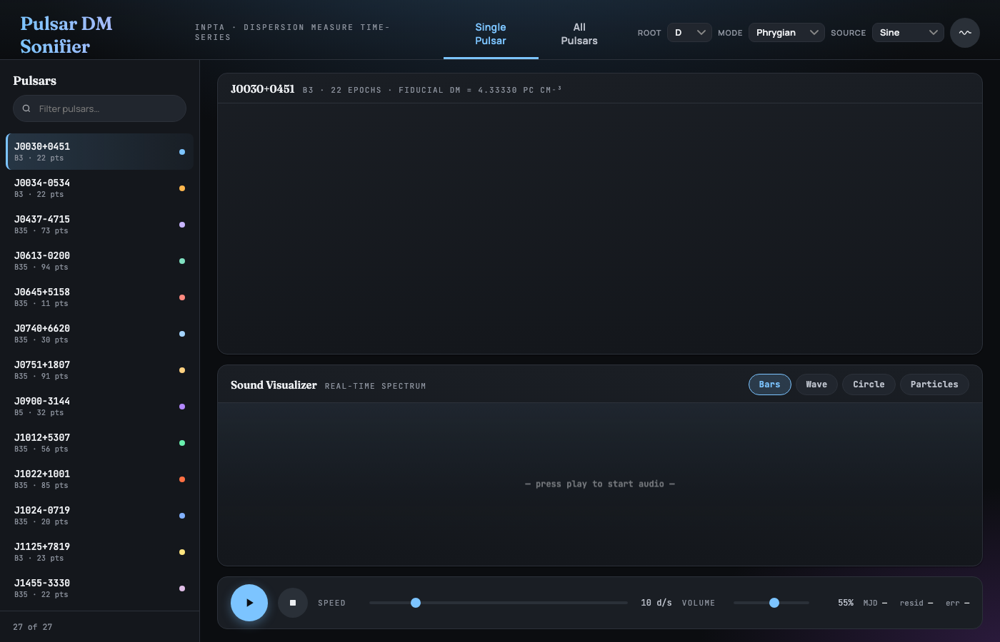
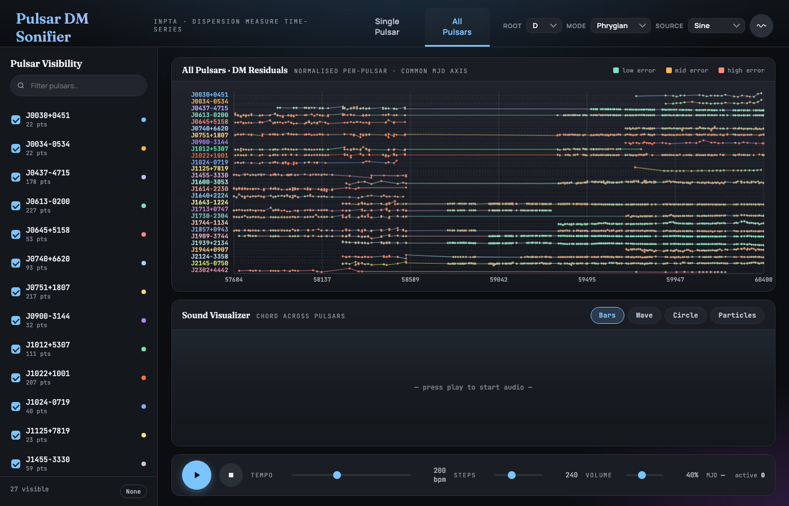

# InPTA Pulsar DM Sonifier

An interactive browser-based tool that turns pulsar Dispersion Measure (DM) time-series data into music. Each observation becomes a note: its pitch encodes how much the DM has drifted from the fiducial value, and the timbre encodes measurement uncertainty — clean tones for precise data, noisy and wavering tones for uncertain ones.

Built from [Indian Pulsar Timing Array (InPTA)](https://inpta.iitr.ac.in/) observations made with the [uGMRT](https://www.ncra.tifr.res.in/ncra/gmrt).

---

## Screenshots

**Single Pulsar view** — select any pulsar from the left rail to see its DM residual time-series and play the sonification:



**All Pulsars view** — all 27 pulsars play simultaneously in a stacked small-multiples layout:



---

## Dataset

27 millisecond pulsars, 3775 raw observations, observed biweekly over several years.

| Band | Frequencies | Notes |
|------|-------------|-------|
| B3   | ~300–500 MHz (centre ~400 MHz) | DM derived from Band 3 data alone |
| B35  | B3 + B5 simultaneously | DM derived from combined Band 3 + Band 5 analysis of the **same observation session**; much lower error because the wide frequency separation (400 vs 1260 MHz) gives a large dispersion lever arm |
| B5   | ~1050–1450 MHz (centre ~1260 MHz) | Single-band, one pulsar only |

When the uGMRT observes in B35 mode it records both bands at the same time. Two DM values are therefore computed from the same session: one from B3-only analysis (lower precision) and one from the full dual-band analysis (B35 file). For pulsars with both files, the B3 file contains the B3-only DM for **all** sessions; the B35 file contains the combined-band DM for the subset of sessions that used dual-band mode. The MJDs in both files are identical for those shared epochs.

When B3 and B35 epochs coincide, the sonifier retains only the B35 measurement (lower error) and discards the B3-only duplicate. Epochs that appear only in the B3 file are kept as-is.

<details>
<summary>All 27 pulsars</summary>

| Pulsar | Bands | Fiducial DM (pc cm⁻³) |
|--------|-------|----------------------|
| J0030+0451 | B3 | 4.3333 |
| J0034−0534 | B3 | 13.7647 |
| J0437−4715 | B3, B35 | 2.6426 |
| J0613−0200 | B3, B35 | 38.7764 |
| J0645+5158 | B3, B35 | 18.2450 |
| J0740+6620 | B3, B35 | 14.9623 |
| J0751+1807 | B3, B35 | 30.2407 |
| J0900−3144 | B5 | 75.6936 |
| J1012+5307 | B3, B35 | 9.0251 |
| J1022+1001 | B3, B35 | 10.2482 |
| J1024−0719 | B3, B35 | 6.4906 |
| J1125+7819 | B3 | 11.2207 |
| J1455−3330 | B3, B35 | 13.5692 |
| J1600−3053 | B3, B35 | 52.3337 |
| J1614−2230 | B3, B35 | 34.4912 |
| J1640+2224 | B3, B35 | 18.4264 |
| J1643−1224 | B3, B35 | 62.3907 |
| J1713+0747 | B3, B35 | 15.9886 |
| J1730−2304 | B3, B35 | 9.6270 |
| J1744−1134 | B3, B35 | 3.1387 |
| J1857+0943 | B3, B35 | 13.3009 |
| J1909−3744 | B3, B35 | 10.3906 |
| J1939+2134 | B3, B35 | 71.0156 |
| J1944+0907 | B3, B35 | 24.3535 |
| J2124−3358 | B3, B35 | 4.5929 |
| J2145−0750 | B3, B35 | 9.0024 |
| J2302+4442 | B3 | 13.7185 |

</details>

---

## Sonification Design

### Pitch → DM residual

Each observation's note is chosen from a diatonic scale (default: D Phrygian, 3 octaves). The **fiducial DM** — DM of a specific epoch for each pulsar — maps to the root note nearest to middle C (the "home" pitch). Positive DM residuals play higher; negative residuals play lower, scaled by the pulsar's own peak deviation so the full dynamic range fills the scale.

### Timbre → measurement error

Three simultaneous acoustic cues encode uncertainty:

| Error level | What you hear |
|-------------|---------------|
| Low (precise) | Clear, bell-like tone; pure and stable |
| Medium | Slight pitch wobble (vibrato at ~5 Hz) |
| High (imprecise) | Heavy vibrato + bandpass-filtered noise centred on the note frequency |

The vibrato depth and noise amplitude both grow monotonically with log-scaled error, so the uncertainty is immediately audible without needing to read any numbers.

### Timing → observation cadence

Playback respects the actual calendar. Each observation fires at its real MJD position; a 15-day gap between observations produces a 15-day gap in the music. Gaps longer than the nominal biweekly cadence produce audible **rests** — silence that represents missing data. The speed slider controls how fast days tick (default 10 days/second, so a ~640-day dataset takes about 64 seconds).

### Drone

An optional sustained sine tone at the fiducial note (root near middle C) runs throughout. It is gated: it sounds only while a note is playing, and falls silent during rests, so it reinforces pitch context without filling gaps with false continuity.

---

## Files

```
make_sonifier.py          Generator script (single self-contained file)
pulsar_dm_sonifier.html   Pre-built output for the InPTA dataset
Pulsar_Fiducial_DM.txt    Fiducial DM table (tab-separated: JNAME  DM)
J<name>_DM_timeseries_<band>.txt   Per-pulsar, per-band time-series files
```

---

## Generating the HTML

**Requirements:** Python 3.6+, no third-party packages.

```bash
python3 make_sonifier.py <data_dir> <output.html>
```

`data_dir` should contain the timeseries files and the fiducial DM table. If the fiducial table lives elsewhere:

```bash
python3 make_sonifier.py ./data out.html --fiducial ./my_fiducials.txt
```

### Input file conventions

**Timeseries files** — filename pattern: `<JNAME>_DM_timeseries_<BAND>.txt`
- Three whitespace-separated columns: `MJD  DM-value  DM-error`
- Comment lines starting with `#` are ignored
- Underscore in the declination part of the J-name means `+` (e.g. `J0030_0451` → `J0030+0451`)
- Hyphen means `−` (e.g. `J0437-4715` stays `J0437-4715`)

**Fiducial DM table** — default filename `Pulsar_Fiducial_DM.txt`
- Two whitespace-separated columns: `JNAME  FiducialDM`
- First row may be a header (detected automatically)
- Unicode minus sign (U+2212) is treated identically to ASCII hyphen

The script computes DM residuals as `DM-value − FiducialDM` and rounds MJDs to the nearest integer day.

---

## Browser Interface

The output is a single, self-contained HTML file with all data and code embedded — no server, no internet connection required after generation.

### Single Pulsar tab

Select a pulsar from the left rail. The timeseries panel shows the DM residual over time with error bars colour-coded green→amber→red by measurement uncertainty. Press ▶ to play; the amber sweep line tracks the current observation in real time. Gaps in the data appear as silence and as a horizontal stretch with no sweep activity.

### All Pulsars tab

All 27 pulsars play simultaneously in a stacked small-multiples view, each row normalised independently. A chord of up to 27 simultaneous notes plays at each time step; the active pulsars highlight as the sweep advances.

### Controls

| Control | Location | Description |
|---------|----------|-------------|
| **Root** | Header | Root pitch class for the scale (C through B), anchored at octave 2 |
| **Mode** | Header | Diatonic mode: Ionian, Dorian, Phrygian, Lydian, Mixolydian, Aeolian, Locrian |
| **Source** | Header | Oscillator type: Sine, Triangle, Sawtooth, Square, FM, Organ |
| **Drone ∿** | Header | Toggle sustained root-note drone (gated to note onsets) |
| **Speed** | Single tab | Playback rate in days per second (2–50 d/s) |
| **Tempo** | All tab | Steps per minute across the shared MJD axis |
| **Volume** | Both tabs | Output level |
| **Bars / Wave / Circle / Particles** | Both tabs | Real-time audio visualizer mode |

### Sound sources

| Source | Character |
|--------|-----------|
| Sine | Warm, clean; sine + slight triangle chorus |
| Triangle | Softer harmonics, mellower than sine |
| Sawtooth | Bright, string-like, rich overtones |
| Square | Hollow, reedy, clarinet-like |
| FM | Bell/metallic; modulation index scales with error so uncertain data sounds metallic and unstable |
| Organ | Additive drawbar: fundamental + 2nd, 3rd, 4th harmonics |

---

## Physical Context

Dispersion Measure is the integrated free-electron column density along the line of sight to a pulsar:

$$\mathrm{DM} = \int_0^d n_e \, dl \quad [\mathrm{pc\ cm}^{-3}]$$

Radio pulses travel faster at higher frequencies, so a pulse emitted at a single moment arrives at the telescope at slightly different times across the observing band. DM is measured by fitting this frequency-dependent delay. Variations in DM over time reflect changes in the intervening interstellar medium — density fluctuations, turbulence, and solar wind — and are an important noise source for gravitational-wave detection via pulsar timing arrays. The InPTA data used here were collected as part of India's contribution to the International Pulsar Timing Array (IPTA).

---

## Technical Notes

- **Band selection:** when a pulsar has both B3 and B35 files, only the B35 data is used (B35 > B3 > B5). B3-only files are used for pulsars that were never observed in dual-band mode, so the sonifier always uses the most precise DM series available for each pulsar.
- **Note duration:** each note fills 80% of the gap to the next observation (capped at 15 days), leaving a 20% silence for articulation. Gaps longer than 15 days produce proportionally longer rests.
- **Audio graph:** Web Audio API; master gain → dynamics compressor → delay/feedback reverb → analyser → destination. All note scheduling uses precise AudioContext timestamps for sample-accurate timing.
- **Compatibility:** works in any modern browser supporting the Web Audio API (Chrome, Firefox, Safari, Edge). No WebGL, no server, no build step.
